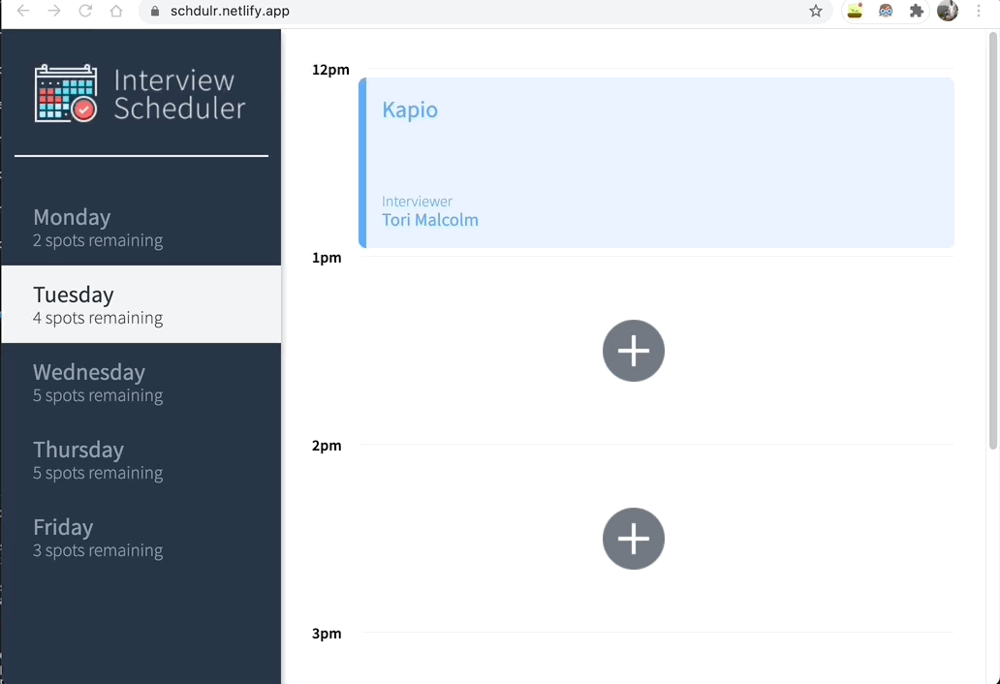

<div align="center">

<h1> Interview Scheduler</h1>
<p>Interview Scheduler is a single page full-stack app to schedule appointment and it provides
real time experience to the user without reloading the page.</p>
<h2><a href="https://schdulr.netlify.app/">Live Demo</a></h2>
</div><br>

## Technologies
- ReactJS
- NodeJS
- Storybook
- Jest
- Cypress
- Netlify
- Websockets
<br><br><br>

## Setup the project on your local system
<br>

1. Clone this repository
```
    git clone git@github.com:kapildoppiogroup/scheduler.git
```
2. Open project directory and install dependencies
```
    npm i
```
3. Run the Server
```
    npm start
```
4. The server must be running on port 8000. <a href="">Visit local host</a>

5. Running Jest Test Framework
```
    npm test
```
6. Running Storybok visual testbed
```
    npm run storybook
```
<br>

## Screenshots:

### Saving an appointment

<br><br>

### Editing an appointment

<br><br>

### Deleting an appointment
